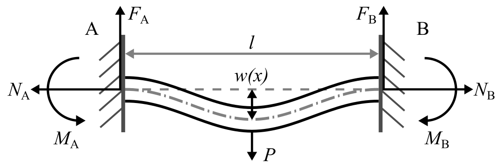

# Paper-2025-Finite-Element-Modeling-of-Fixed-Fixed-Beams-Under-Shock-Excitation-With-Active-Control
Code for the 2025 ASME IMECE paper titled Finite Element Modeling of Fixed Fixed Beams Under Shock Excitation With Active Control

---

## Overview

The simulation models a fixed-fixed beam subjected to an impulsive vertical load representative of drop tower shock testing in electronics. Surface-mounted piezoelectric actuators are emulated by applying moment couples to the beam’s rotational degrees of freedom.

The finite element model captures axial, transverse, and rotational dynamics using modified Euler-Bernoulli beam theory. Control forces are introduced as time-varying moment couples based on relative nodal rotations.

---

## Simulation Framework



**Figure 1:** Visualization of the fixed-fixed beam FEM.


**Figure 2:** Visualization of control moment application via surface-actuated moment couples.

- **Material:** FR4 composite (approximated)
- **Beam Geometry:** 88.90 mm (length) × 25.40 mm (width) × 1.60 mm (thickness)
- **DOFs per node:** Axial, vertical, and rotational
- **Discretization:** 49 finite elements (50 nodes)
- **Loading:** 30 N vertical impulse for 0.1 ms at midspan
- **Actuation:** Moment couples at nodes 16 and 34
- **Integration:** Newmark-Beta, Δt = 0.1 ms
- **Damping:** 2% Rayleigh damping on first two modes

---

## Control Implementation

A curvature-sensitive PID controller is implemented to apply bending moment couples between adjacent rotational DOFs:
```math
M_{control} = -K_p(\theta_R - \theta_L) - K_d(\dot{\theta}_R - \dot{\theta}_L) - K_i \int (\theta_R - \theta_L) \, dt
```
- **Kp** = 0.1
- **Kd** = 1.5e-4
- **Ki** = 0.01

A control shutoff activates when the midpoint displacement remains below 7.5% of the free-response peak for 5 ms to reduce unnecessary actuation.

---

## Results


**Figure 3:** Midpoint displacement of the beam under impulse loading (PID vs. free response).

| Metric             | Uncontrolled | PID-Controlled | Improvement |
|-------------------|--------------|----------------|-------------|
| Peak Displacement | 0.42 mm      | 0.41 mm        | 3.7%        |
| Settling Time     | 27.0 ms      | 16.3 ms        | 39.6%       |
| RMS Acceleration  | 80.94 dB     | 80.87 dB       | 0.08%       |

---


## Licensing and Citation

This work is licensed under a Creative Commons Attribution-ShareAlike 4.0 International License [cc-by-sa 4.0].

[](https://creativecommons.org/licenses/by-sa/4.0/)


Cite this data as: 

#### Bibtex

@Misc{ARTSLab2025Paper2025Finite,    
  author = {{ARTS-L}ab},  
  howpublished = {GitHub},  
  title  = {Paper 2025 Finite Element Modeling of Fixed-Fixed Beams Under Shock Excitation with Active Control},  
  groups = {ARTS-Lab},    
  year = {2025},   
  url    = {https://github.com/ARTS-Laboratory/Paper-2025-Active-Vibration-Control-of-Fixed-Fixed-Beams-using-Data-driven-Control},   
}


